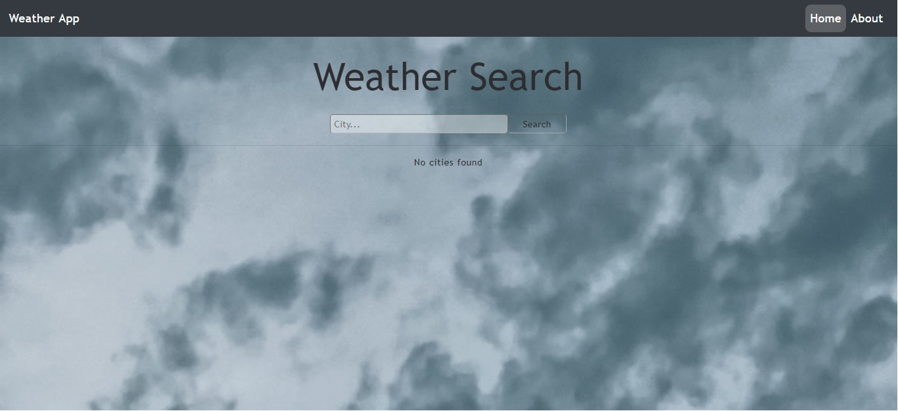
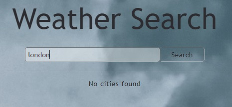
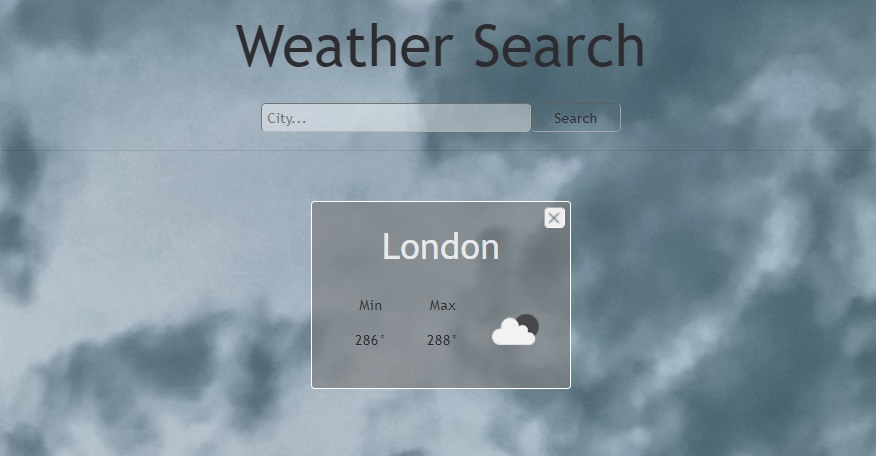
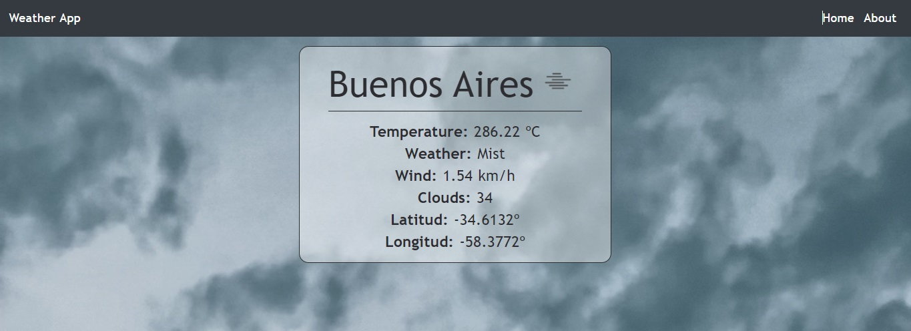
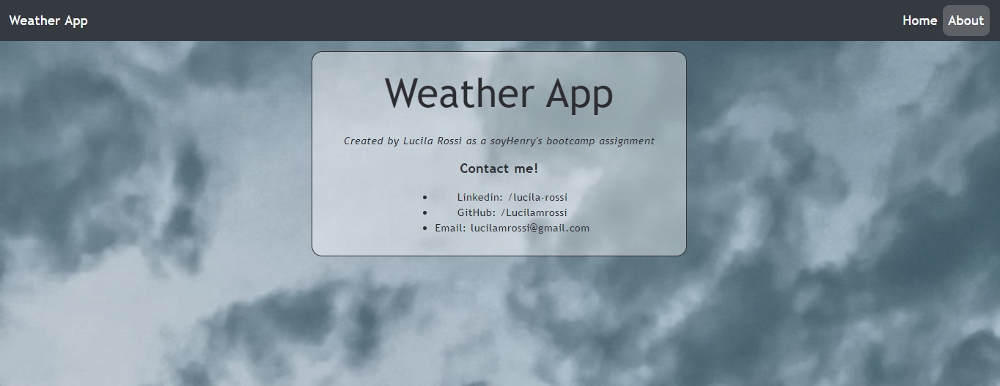

# weather-app

## Introduction

> This is an educational proyect made by Lucila Rossi as an assigment for the soyHenry's bootcamp in order to practice React tools. 

## Instructions

1. Install all dependencies
2. Got to https://openweathermap.org/api and suscribe to "Current Weather Data" in oder to get your apiKey
3. Once you have gotten your apiKey create a .env file in your root folder
4. Add the following variable: REACT_APP_API_KEY and equal it to your apiKey
5. Run "npm start" and enjoy the app!

## Some previews!
> Check the<a href="https://vimeo.com/572357711" target="blank"> video!</a>

1. Home page as soon as you enter the webSite

  

2. Searching for London

  
  

3. Searching for more and more cities!

  

4. Checking for Buenos Aires details

  

5. About section

  

## Contact me!

📫 How to reach me 
- **lucilamrossi@gmail.com**
- LinkedIn: <a href="https://linkedin.com/in/lucila-rossi" target="blank">/lucila-rossi </a>
- GitHub: <a href="https://github.com/Lucilamrossi" target="blank">/Lucilamrossi </a>
