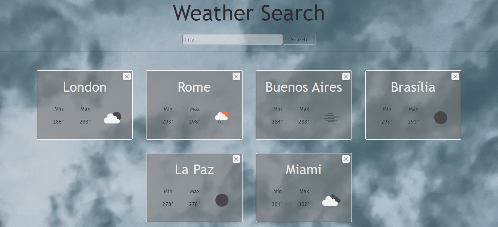

# weather-app

## Check out the website working:
> <a href="https://weather-app-lucilamrossi.netlify.app/" target="blank">Click here!</a>

## Or watch a video here:
> <a href="https://vimeo.com/572410575" target="blank">Check the video!</a>

## Introduction and Tecnologies

> This is an educational project made by Lucila Rossi as an assigment for the soyHenry's bootcamp. 
> The website was made entirely with React, getting information from an external API. 
> The styles were made with bootstrap and some css
> The purpose of this project was to learn and practice the React flow

## Instructions

1. Install all dependencies
2. Got to https://openweathermap.org/api and suscribe to "Current Weather Data" in oder to get your apiKey
3. Once you have gotten your apiKey create a .env file in your root folder
4. Add the following variable: REACT_APP_API_KEY and equal it to your apiKey
5. Run "npm start" and enjoy the app!

## Some previews!
> Check some previews from the website

1. Home page as soon as you enter the webSite

  

2. Searching for London

  
  

3. Searching for more and more cities!

  

4. Checking for Buenos Aires details

  

5. About section

  

## Contact me!

📫 How to reach me 
- **lucilamrossi@gmail.com**
- LinkedIn: <a href="https://linkedin.com/in/lucila-rossi" target="blank">/lucila-rossi </a>
- GitHub: <a href="https://github.com/Lucilamrossi" target="blank">/Lucilamrossi </a>
